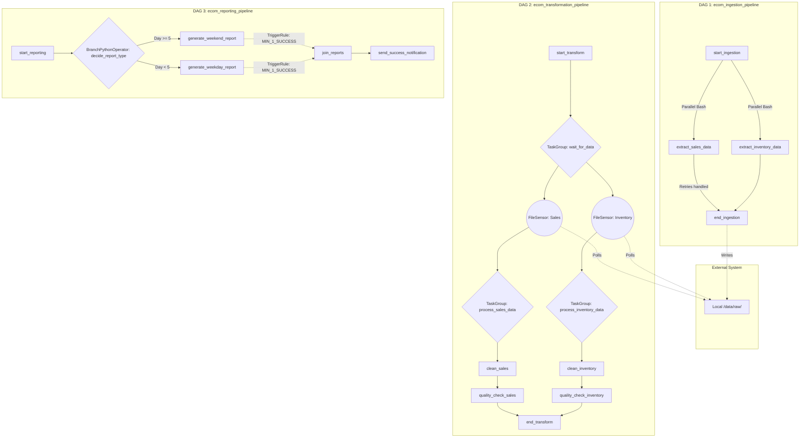

# OrchestraFlow - Pipeline Architecture

## The Process flow
The system showcases a modular, fault-tolerant approach relying on Apache Airflow context passing and conditional triggers.

### The DAG Interaction diagram

## Description of components
1. **Mock Extractors**: Short python scripts wrapped by `BashOperator`. Useful when Airflow manages dependencies outside Python libraries (e.g. running dbt, Go binaries, Node).
2. **File Sensors**: `mode='poke'` actively monitors specific output locations preventing transformation failures if upstream systems take longer than expected.
3. **Trigger Rules**: Branching natively skips one path. `JoinReports` implements `TriggerRule.NONE_FAILED_MIN_ONE_SUCCESS` instead of the default `all_success` to prevent the final node from being skipped.
